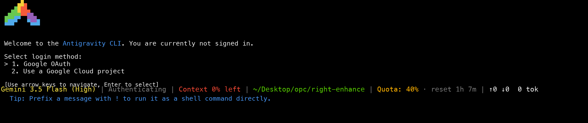

# Antigravity CLI Status Line

English | [中文](#中文)

A colorful status line for Antigravity CLI / `agy` that shows:

- active model
- agent state
- context remaining percentage
- current working directory
- real quota remaining for the active model
- session token totals
- rotating tips

It reads quota directly from the local Antigravity `language_server` `GetUserStatus` API, the same local state used by `/usage`. No manual sync is required in normal use.

## Preview



```text
Gemini 3.1 Pro (High) | Idle | Context 92% left | ~/Desktop/opc/right-enhance | Quota: 40% · reset 1h 21m | ↑85k ↓15k 100k tok
  Tip: Use /agents to see all active sub-agents and their status.
```

## Install

```bash
git clone https://github.com/60ke/antigravity-statusline.git
cd antigravity-statusline
./install.sh
```

Then restart Antigravity CLI or start a new `agy` session.

The installer:

- copies scripts to `~/.antigravity/`
- backs up existing files to `~/.antigravity/backups/`
- updates `~/.gemini/antigravity-cli/settings.json`
- preserves all unrelated settings

## One-Line Install

```bash
git clone https://github.com/60ke/antigravity-statusline.git /tmp/antigravity-statusline && /tmp/antigravity-statusline/install.sh
```

## Uninstall

```bash
cd antigravity-statusline
./uninstall.sh
```

The uninstaller removes the installed scripts and removes this repo's `statusLine` command from Antigravity settings. It also creates a backup before editing settings.

## How Quota Works

The status line automatically:

- finds the local Antigravity `language_server` process
- finds local `agy` CLI server processes
- extracts the local CSRF token from its command line
- discovers the local listening port
- calls `GetUserStatus`
- matches quota by the active model label
- prefers the local API response whose email matches the current Antigravity CLI session
- shows the reset countdown from the model quota reset time

Quota refreshes every 30 seconds by default. It also refreshes immediately when the active session/account/model changes or when the cache is missing.

If the local API is briefly unavailable, it falls back to the last successful cache:

```text
~/.antigravity/quota-cache.json
```

## Manual Fallback

If the local API is unavailable, run `/usage`, copy the output, then:

```bash
pbpaste | python3 ~/.antigravity/agy-quota-cache.py
```

## Environment Variables

- `AGY_STATUSLINE_DIR`: install directory, default `~/.antigravity`
- `AGY_SETTINGS_FILE`: settings path, default `~/.gemini/antigravity-cli/settings.json`
- `AGY_QUOTA_CACHE`: quota cache path, default `~/.antigravity/quota-cache.json`
- `AGY_QUOTA_MAX_AGE_SECONDS`: cache max age, default `900`
- `AGY_QUOTA_REFRESH_INTERVAL_SECONDS`: live refresh interval, default `30`

## Files

- `status.py`: status line renderer and live quota fetcher
- `agy-quota-cache.py`: manual `/usage` parser fallback
- `install.sh`: installer
- `uninstall.sh`: uninstaller

---

## 中文

[English](#antigravity-cli-status-line) | 中文

这是一个给 Antigravity CLI / `agy` 用的彩色状态栏配置，可以显示：

- 当前模型
- Agent 状态
- 上下文剩余百分比
- 当前工作目录
- 当前模型的真实剩余额度
- 本轮 token 统计
- 轮换 Tips

它会直接读取本机 Antigravity `language_server` 的 `GetUserStatus` 接口，数据来源和内置 `/usage` 是同一套本地状态。正常情况下不需要手动同步。

## 效果


```text
Gemini 3.1 Pro (High) | Idle | Context 92% left | ~/Desktop/opc/right-enhance | Quota: 40% · reset 1h 21m | ↑85k ↓15k 100k tok
  Tip: Use /agents to see all active sub-agents and their status.
```

## 安装

```bash
git clone https://github.com/60ke/antigravity-statusline.git
cd antigravity-statusline
./install.sh
```

然后重启 Antigravity CLI，或者重新打开一个 `agy` 会话。

安装脚本会：

- 把脚本复制到 `~/.antigravity/`
- 把旧文件备份到 `~/.antigravity/backups/`
- 更新 `~/.gemini/antigravity-cli/settings.json`
- 保留所有无关配置

## 一行安装

```bash
git clone https://github.com/60ke/antigravity-statusline.git /tmp/antigravity-statusline && /tmp/antigravity-statusline/install.sh
```

## 卸载

```bash
cd antigravity-statusline
./uninstall.sh
```

卸载脚本会删除安装到 `~/.antigravity/` 的脚本，并移除本仓库写入的 `statusLine` 配置。修改配置前也会自动备份。

## Quota 原理

状态栏会自动：

- 查找本机 Antigravity `language_server` 进程
- 查找本机 `agy` CLI server 进程
- 从进程命令行提取本地 CSRF token
- 发现本地监听端口
- 调用 `GetUserStatus`
- 按当前模型名称匹配 quota
- 优先使用 email 与当前 Antigravity CLI 会话一致的本地 API 响应
- 根据模型 quota reset time 显示重置倒计时

默认每 30 秒刷新一次。新会话、账号、模型变化或缓存不存在时，会立即刷新。

如果本地接口短暂不可用，会回退到上一次成功缓存：

```text
~/.antigravity/quota-cache.json
```

## 手动备用

如果本地接口不可用，可以运行 `/usage`，复制输出，然后执行：

```bash
pbpaste | python3 ~/.antigravity/agy-quota-cache.py
```

## 环境变量

- `AGY_STATUSLINE_DIR`: 安装目录，默认 `~/.antigravity`
- `AGY_SETTINGS_FILE`: settings 路径，默认 `~/.gemini/antigravity-cli/settings.json`
- `AGY_QUOTA_CACHE`: quota 缓存路径，默认 `~/.antigravity/quota-cache.json`
- `AGY_QUOTA_MAX_AGE_SECONDS`: 缓存最长有效时间，默认 `900`
- `AGY_QUOTA_REFRESH_INTERVAL_SECONDS`: 实时刷新间隔，默认 `30`

## 文件说明

- `status.py`: 状态栏渲染和实时 quota 获取
- `agy-quota-cache.py`: 手动 `/usage` 解析备用工具
- `install.sh`: 安装脚本
- `uninstall.sh`: 卸载脚本
